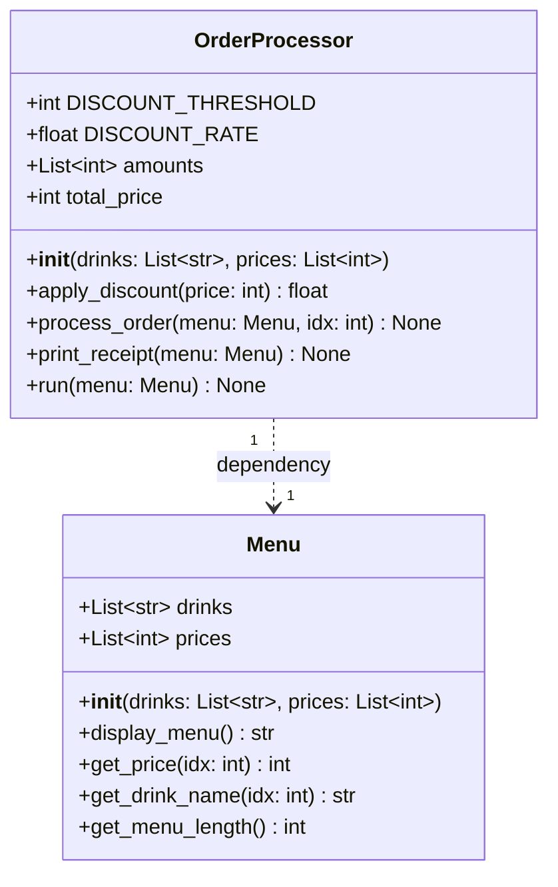

```mermaid
classDiagram
    class Menu {
        +List~str~ drinks
        +List~int~ prices
        +__init__(drinks: List~str~, prices: List~int~)
        +display_menu() str
        +get_price(idx: int) int
        +get_drink_name(idx: int) str
        +get_menu_length() int
    }

    class OrderProcessor {
        +int DISCOUNT_THRESHOLD
        +float DISCOUNT_RATE
        +List~int~ amounts
        +int total_price
        +__init__(drinks: List~str~, prices: List~int~)
        +apply_discount(price: int) float
        +process_order(menu: Menu, idx: int) None
        +print_receipt(menu: Menu) None
        +run(menu: Menu) None
    }

    %% dependency (Use-a) 관계: OrderProcessor가 Menu의 Life cycle이 서로 다르다.
    OrderProcessor "1" ..> "1" Menu : dependency
```